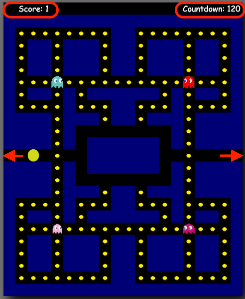

# [CAKEMAN](https://muharremb.github.io/singlePageAppJS/)

# JS Personal Project: Cake-Man Game

## Background
Cake-Man is a different version of Pac-Man which was originally released at 1980. In my version, ghosts have same behaviour, around 50% of the time they directly chase Cakeman. If they cant move to the Cakeman direction, the ghosts check adjacent positions and select a random move. 

## Instructions to Play Cake-Man
The player control cakeman using only arrow keys: UP, DOWN, LEFT, RIGHT. The player should eat all the dots while avoiding ghosts. There is a fixed timer on the upper right, initially set at 120 seconds. Timer starts when the player pushes any controlling buttons. After the game finished, the page refreshes itself after 7 seconds and back to start. 



## Technologies, Libraries, APIs
The Cake-Man Game is a Single Page Application written in JavaScript using Webpack for bundling and Canvas 2D for drawing. 

## Implementation
Index.js is the main entry for the application. After the page loads, it creates a new game object passing canvas element as an input and then triggers Game#start method. 

Game.js is the main part of the code as Game class has a full picture of the game situation. Game#start function creates tileMap, cakeman, ghosts(red, yellow, purple and pink) objects. And it triggers Game#gameIter method using setInterval. 

Game#gameIter method triggers tileMap, ghosts and cakeman drawing functions in TileMap. Each method has its own triggered functions inside, such as Ghost#move and Cakeman#move. 

For Ghosts, rather than pure random movements, I designed Ghost moves based on possible directions and adjacent tile closest to cakeman position. 

    ```
    Ghost.prototype.changeDirection = function changeDirection(cakeman) {
        let newMoveDirection = null;
        let newMoveDirectionName = null;
        let possibleDirections = [];

        if((this.x % this.tileSize === 0) && (this.y % this.tileSize === 0)) {
            for(let i=1; i<5; i++) {
                if(!this.tileMap.didCollidedWithEnv(this.x, this.y, i)){
                    let distance = Util.dist(this.mockMove(i), [cakeman.x, cakeman.y]);
                    possibleDirections.push(i);
                }
            }
            
            possibleDirections = possibleDirections.filter(item => item !== 5-this.movingDirection);

            if(getRandomInt(1,2,3,4)<3) {
                newMoveDirection = possibleDirections[Math.floor(Math.random()*possibleDirections.length)];
            } else newMoveDirection = Util.findDirectionForGhost(this, cakeman, this.tileMap);
            
            this.movingDirection = newMoveDirection;

            // if((this.x % this.tileSize === 0) && (this.y % this.tileSize === 0) && this.id === 3) {
            //     let nextmoveDirection = this.tileMap.buildTree(this, cakeman);
            //     // console.log(nextmoveDirection);
            //     if(nextmoveDirection !== 777) this.movingDirection = nextmoveDirection;
            // }
        }
    }
    ```

    For each change direction call; function checks possible directions ignoring opposite direction(no turn back for ghost). Then, depending on the random event it decides either calling Utility function or pure random selection. Using ghost.id attribute; one can design different move pattern for each ghost. 

    In the code above, last five lines are for Breadth First Search Algorithm. It is not finished yet, but the direction selection could be improved. I tried to implement the algoritm to find next direction. 
    Please keep in mind that, iteration function is called in every 15miliseconds, I am not sure about the efficiency though. TreeNode implementation is on polyTreeNode.js and breadth first algorithm code is TileMap#buildTree. 


-   TileMap#draw function iterates over predetermined array and depending on the value, calls TileMap#drawWall, TileMap#drawDot, TileMap#drawEmpty functions. 

-   Cakeman#draw function draws cakeman on the tileMap but also trigger other functions; Cakeman#move, Cakeman#animate, Cakeman#removeDot. 

There is one thing to highlight, regarding draw and animate functions. 

* I saw implementation of draw and animate on the CodingWith-Adam Github page and MDN web docs; and used in this project.

    Drawing pacman and rotating depending on the direction is done using CanvasAPI translate, rotate and restore functions combined. 

    [Mozilla Tutorial](https://developer.mozilla.org/en-US/docs/Web/API/Canvas_API/Tutorial/Transformations)

    ```
        Cakeman.prototype.draw = function(ctx) {
            this.move();
            this.animate();
            this.removeDot();
            // Rather than using multiple image, only one image was used for rotation. 
            // https://developer.mozilla.org/en-US/docs/Web/API/Canvas_API/Tutorial/Transformations
            let size = this.tileSize / 2;
            ctx.save();
            ctx.translate(this.x + size, this.y + size);
            ctx.rotate((this.cakemanRotation * 90 * Math.PI) / 180);
            ctx.drawImage(
                this.cakemanImages[this.cakemanImageIndex],
                -size,
                -size,
                this.tileSize,
                this.tileSize
            );
            ctx.restore();
        };
    ```

    Animate function uses animateTimer and animateDefault attributes, start and default value respectively. At every move, it reduces animateTimer value by 1. If it hits 0; it resets to animatedDefault, change animdated image. 

    ```
        this.animateTimer = null;
        this.animateDefault = 10;
        
        Cakeman.prototype.animate = function animate() {
            if(!this.animateTimer) {
                return;
            }
            this.animateTimer -=1;
            if(this.animateTimer === 0) {
                this.animateTimer = this.animateDefault;
                this.cakemanImageIndex += 1;
                if(this.cakemanImageIndex === this.cakemanImages.length) {
                    this.cakemanImageIndex = 0;
                }
            }
        };
    ```

## TODOs
* Breadth First Search Algorigthm function is not working properly. Initial tests suggest that outbound checks were missing, which led to Node.parent attribute set to undefined which led to crash. Row, Column checks need to be changed. 

* User interface should be improved: adding sound button, arrow key symbols in instructions, winning screen animation. 

## Potential Improvements
* Seperate moving logic for each ghost
* Using Tensorflow Hand Gesture Recognition, one can play using camera input and provide directions using hand gestures. Similar to ['Rock, Paper and Scissors App'](https://hackernoon.com/how-to-make-a-rock-paper-scissors-app-with-tensorflow-and-hand-gesture-recognition)

* Integrating Google Maps and playing on Google Maps. Google did it in 2017 for April Fool day. 

## Resources
* [Mozilla Square tilemaps implementation for Static maps](https://developer.mozilla.org/en-US/docs/Games/Techniques/Tilemaps/Square_tilemaps_implementation:_Static_maps)
* [Mozilla 2d Detection Collision](https://developer.mozilla.org/en-US/docs/Games/Techniques/2D_collision_detection)
* [CodingWith Adam](https://github.com/CodingWith-Adam)
* [Google Fonts Bungee Spice](https://fonts.google.com/specimen/Bungee+Spice)

